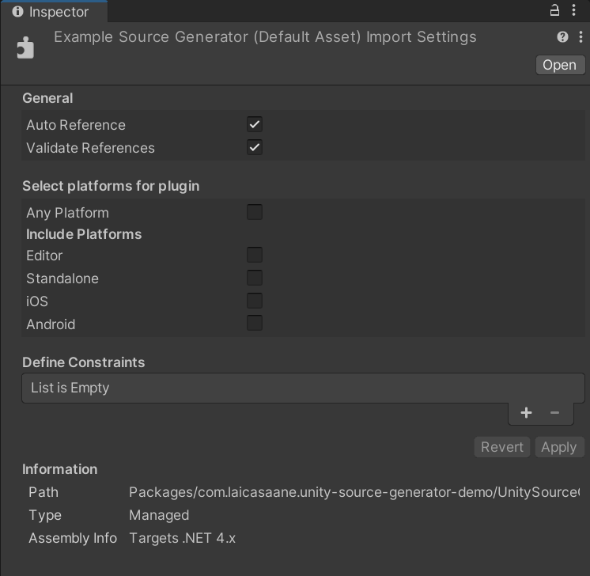
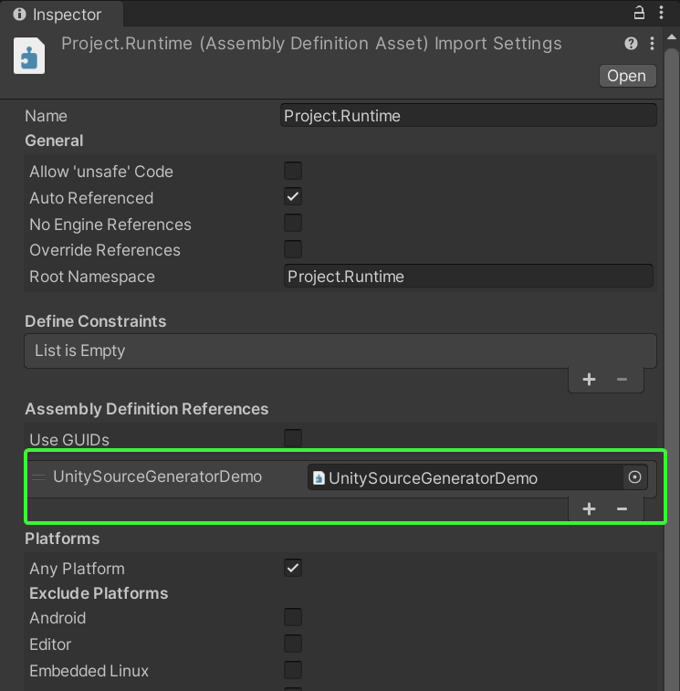
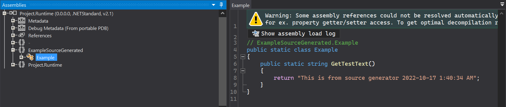

# Source Generator Setup

## Requirements

- Unity 2021.3 or higher

## Tutorial

1. Create a UPM package following this [guide](https://docs.unity3d.com/Manual/CustomPackages.html)

2. Make sure that the package must contains 1 `.asmdef` file

3. Make sure that the package must contains **at least** 1 `.cs` file along with that `.asmdef`

    > :warning: **IMPORTANT**
    >
    > If there is no `.cs` file in the package, the `.asmdef` won't get compiled
    > thus source generators won't work at all.

    - It can be just 1 simple empty `.cs` file, no special name is needed

<br/>

4. Create a new folder named `Source~` inside the package to store the C# project of source generators
    - Unity will ignore any folder that ends with `~` (see [Hidden Assets](https://docs.unity3d.com/Manual/SpecialFolders.html))

<br/>

5. Inside the `Source~` folder, create a C# project for the source generator
    - It must be a .NET standard library project that targets `.NET Standard 2.0`
    - It must use `Microsoft.CodeAnalysis.CSharp` version `3.8.0`
    - See [Source generators](https://docs.unity3d.com/Manual/roslyn-analyzers.html)

<br/>

6. Add this block to the `.csproj` file to automatically copy the built `.dll`s over to the UPM package

```xml
<Target Name="CopyBuildArtifacts" AfterTargets="Build">
    <ItemGroup>
        <DataFiles Include="$(ProjectDir)$(OutDir)*.dll" />
    </ItemGroup>
    <Copy SourceFiles="@(DataFiles)" DestinationFolder="<Relative_Path_To_Package_Folder>" SkipUnchangedFiles="true" />
</Target>
```

<br/>

7. Replace the value of `DestinationFolder` property with the actually relative path to the UPM package


For example, this is the relative path used in the demo (`ExampleSourceGenerator.csproj`):

```diff
<Target Name="CopyBuildArtifacts" AfterTargets="Build">
    <ItemGroup>
        <DataFiles Include="$(ProjectDir)$(OutDir)*.dll" />
    </ItemGroup>
-    <Copy SourceFiles="@(DataFiles)" DestinationFolder="<Relative_Path_To_Package_Folder>" SkipUnchangedFiles="true" />
+    <Copy SourceFiles="@(DataFiles)" DestinationFolder="$(ProjectDir)../../../UnitySourceGeneratorDemo/Plugins/" SkipUnchangedFiles="true" />
</Target>
```

<br/>

8. After building the source generator, locate its `.dll` in the `Relative_Path_To_Package_Folder` in Unity's Project window then configure it like this in the Inspector window:



<br/>

9. Open the corresponding `.dll.meta` file by any text editor and add these 2 lines right under the `guid`

```yaml
labels:
- RoslynAnalyzer
```

For example, this is the `ExampleSourceGenerator.dll.meta` in this demo:

```diff
fileFormatVersion: 2
guid: 295448825f3c52a4f94badd6ad5dcf0d
+ labels:
+ - RoslynAnalyzer
PluginImporter:
  externalObjects: {}
  serializedVersion: 2
  iconMap: {}
  executionOrder: {}
  defineConstraints: []
  isPreloaded: 0
  isOverridable: 0
  isExplicitlyReferenced: 0
  validateReferences: 1
  platformData:
<...>
```

> See step 7 and 8 in the [document](https://docs.unity3d.com/Manual/roslyn-analyzers.html)

> :warning: For Unity 2021, it is impossible to assign labels to `.dll`s inside a UPM package

<br/>

10. In order to use the source generator, we must make the project `.asmdef` refer to the package `.asmdef`



<br/>

11. To see if the generator really works, we can use [ILSpy](https://github.com/icsharpcode/ILSpy) to inspect the corresponding `.dll` inside the `Library/ScriptAssemblies` directory


